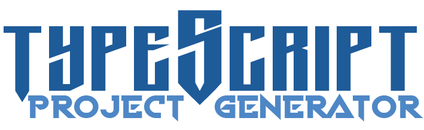

<div align="center">
  
</div>


[](https://www.npmjs.com/package/typescript-project-generator)
[](https://github.com/AnthonyLzq/simba.js/blob/master/LICENSE)
[](https://biomejs.dev/)
[](https://reactjs.org/docs/how-to-contribute.html#your-first-pull-request)
[](https://github.com/AnthonyLzq/typescript-project-generator/actions/workflows/lint.yml)

# TypeScript Project Generator

A modern CLI tool that creates production-ready TypeScript projects with opinionated but flexible configuration. Generate complete project boilerplates with modern tooling and best practices in seconds.

## ⚡ Quick Start

```bash
# Install globally
npm i -g typescript-project-generator

# Generate a new project
tpg
```

## What's New in v7.0.0

- **Test Framework Choice**: Interactive selection between Jest and Vitest
- **Modern Standards**: ES2022 target with strict TypeScript configuration  
- **Enhanced Validation**: Strict project name validation (lowercase, numbers, hyphens)
- **Node.js v18+**: Required for optimal performance and modern features
- **Biome Integration**: Ultra-fast linting and formatting out of the box

## Generated Project Features

### Core Development Tools
- **TypeScript**: ES2022 target with strict configuration
- **Test Framework**: Choose between Jest or Vitest during setup
- **Biome**: Modern linter and formatter (replaces ESLint + Prettier)
- **Docker**: Production-ready Dockerfile with dynamic Node.js version
- **GitHub Actions**: Complete CI/CD workflows

### Project Structure
Your generated project includes all essential files:

- `.env` - Environment variables template
- `biome.json` - Modern linter and formatter configuration
- `.biomeignore` - Files to exclude from Biome processing
- `.gitignore` - Git ignore patterns
- `CHANGELOG.md` - Project changelog template
- `Dockerfile` - Production-ready container configuration
- `jest.config.ts` or `vitest.config.mts` - Test framework configuration
- `LICENSE` - Your chosen license file
- `package.json` - Project dependencies and scripts
- `README.md` - Comprehensive project documentation
- `tsconfig.base.json` - Base TypeScript configuration
- `tsconfig.json` - Main TypeScript configuration
- `src/index.ts` - Main application entry point
- `test/index.test.ts` - Initial test file
- `.github/workflows/` - Complete CI/CD pipeline

## Interactive Setup Process

The generator guides you through a comprehensive setup with the following prompts:

### Project Information
- **Project name** - Validates lowercase, numbers, and hyphens only
- **Description** - Brief project description
- **Keywords** - Tags for package.json discoverability
- **Author name** - Your name for package.json and LICENSE
- **GitHub username** - For repository URLs and package.json

### Technical Configuration  
- **License type** - Choose from popular licenses (MIT, Apache-2.0, GPL-3.0, etc.)
- **Package manager** - npm, yarn, or pnpm support
- **Test framework** - **NEW!** Choose between Jest or Vitest
- **Default port** - For server applications (optional)
- **GitHub repository** - Repository name for CI/CD integration
- **Heroku deployment** - Optional CD workflow for Heroku

### Test Framework Choice

**Jest** (Traditional)
- Mature and stable testing framework
- Extensive ecosystem and community support
- Zero-config setup for most TypeScript projects
- Built-in code coverage and mocking

**Vitest** (Modern)
- Ultra-fast test execution with native ES modules
- Vite-powered with instant HMR during testing
- TypeScript-first design and configuration
- Modern API with Jest-compatible assertions

## Generated Project Structure

After completing setup, your project will have this structure:

```
📂.github
 ┣ 📂workflows
   ┣ 📜lint.yml
   ┗ 📜test.yml
📂src
 ┗ 📜index.ts
📂test
 ┗ 📜index.test.ts
📜.biomeignore
📜.dockerignore
📜.env
📜.gitignore
📜biome.json
📜CHANGELOG.md
📜Dockerfile
📜jest.config.ts OR vitest.config.mts
📜LICENSE
📜package.json
📜README.md
📜tsconfig.base.json
📜tsconfig.json
📜pnpm-lock.yaml (or package-lock.json or yarn.lock)
```

After generation, `git` will be initialized and dependencies will be installed based on your chosen package manager.

## Prerequisites

- **Node.js v18 or higher** - Required for optimal performance and modern features
- **Internet connection** - For installing packages and fetching license content
- **Git** - For repository initialization

## Installation

**This tool is designed to be installed globally** to create new projects anywhere on your system.

```console
npm i -g typescript-project-generator
```

## Usage

Run the generator from any directory where you want to create your new project:

```console
tpg
```

The interactive CLI will guide you through the complete setup process with modern validation and helpful prompts.

## Generated Dependencies

### Core Dependencies (Always Included)

- [`@biomejs/biome`](https://www.npmjs.com/package/@biomejs/biome) - Modern linter and formatter
- [`@types/node`](https://www.npmjs.com/package/@types/node) - Node.js type definitions
- [`dotenv`](https://www.npmjs.com/package/dotenv) - Environment variable management
- [`nodemon`](https://www.npmjs.com/package/nodemon) - Development file watcher
- [`ts-node`](https://www.npmjs.com/package/ts-node) - TypeScript execution for Node.js
- [`tsconfig-paths`](https://www.npmjs.com/package/tsconfig-paths) - Path mapping support
- [`typescript`](https://www.npmjs.com/package/typescript) - TypeScript compiler

### Test Framework Dependencies

**When choosing Jest:**
- [`@jest/types`](https://www.npmjs.com/package/@jest/types)
- [`@types/jest`](https://www.npmjs.com/package/@types/jest)
- [`jest`](https://www.npmjs.com/package/jest)
- [`ts-jest`](https://www.npmjs.com/package/ts-jest)

**When choosing Vitest:**
- [`vitest`](https://www.npmjs.com/package/vitest)

## 🔄 Migration from Older Versions

If you're upgrading from a previous version of TPG:

- **ESLint → Biome**: Projects now use Biome for faster linting and formatting
- **Jest vs Vitest**: New projects can choose their preferred test framework
- **ES2022**: Updated TypeScript target for modern JavaScript features
- **Node.js v18+**: Minimum version requirement for security and performance

## Contributing

## Hey, this project use to contain a backend generator!

Yes, it used to. But that approach has been deprecated in favor of my new backend framework, [Simba.js](https://www.npmjs.com/package/@anthonylzq/simba.js).

## Author

- **Anthony Luzquiños** - _Initial Work_ - _Documentation_ - [AnthonyLzq](https://github.com/AnthonyLzq).

## Contributors

- **Andree Anchi** - _Bug reports_ - [andreewaD](https://github.com/andreewD).
